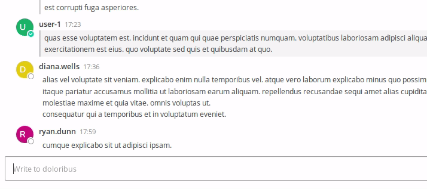
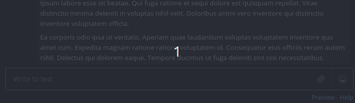

# A Mattermost Weather Plugin
## Summary
A very simple Mattermost plugin that will query the National Weather Service for the current conditions and enter them into chat. Currently US-only, sorry.

Also the NWS API is a little slow sometimes, but it's public and doesn't require an API key or anything like that, which simplifies distribution, installation, and configuration of the plugin.

Here is a brief demonstration of the plugin:

Here is a demonstration of some feedback you get when things go wrong:

## Installation

Download the `.tar.gz` from the [releases page](https://github.com/gigawhitlocks/mattermost-plugin-weather/releases "the releases page is the standard Github location for downloads") and install the plugin through the System Console in Mattermost. The details of that process are beyond the scope of this document.

## Configuration

There is no available configuration.
